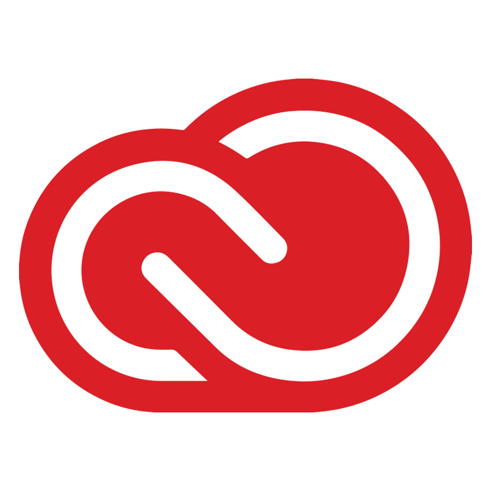

  

    
  
 
  <h1>
    Hello traveler, welcome to my GitHub profile.
      
  </h1>
  <h3>
    I am Shawn, a Full-Stack Developer and Media Designer.
  </h3>

  

    
    
    
  

 
  
- 🔥 Ambitious to develop good looking and functional applications!
- 💪🏽 Always on the grind to improve me, every day 1% better than the day before!
- 😲 Curious about the latest design and tech trends!
- 💡 Open-minded and constantly seeking new challenges and opportunities!

  
   
   
  
  

    
  

#

### :hammer_and_wrench: Languages and Tools:
 

  
  
  

  
  
  
  
  
  
  
  
  
  

<!--
**Cyber-SW/Cyber-SW** is a ✨ _special_ ✨ repository because its `README.md` (this file) appears on your GitHub profile.

Here are some ideas to get you started:

- 🔭 I’m currently working on ...
- 🌱 I’m currently learning ...
- 👯 I’m looking to collaborate on ...
- 🤔 I’m looking for help with ...
- 💬 Ask me about ...
- 📫 How to reach me: ...
- ⚡ Fun fact: ...
-->
